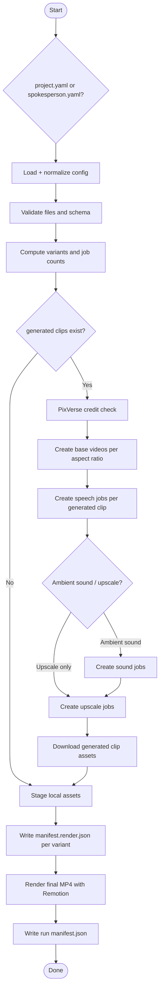

# Pipeline Diagram

## Flow Overview



## Job Count Formula

```text
base_jobs   = number of requested aspect ratios if any generated clip exists else 0
speech_jobs = generated_clips x aspect_ratios
sound_jobs  = speech_jobs if ambientSound else 0
upscale_jobs = speech_jobs if upscale else 0
total_jobs  = base_jobs + speech_jobs + sound_jobs + upscale_jobs
```
